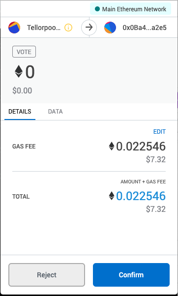

# Voting on Disputes
This document covers how to vote on disputes.

# About Voting
TRB holders vote on the validity of the data and if the miner is found to be _malicious_ their stake goes to the party that initiated the dispute, otherwise the dispute fee goes to the miner.

# Prerequsites
* You will need Metamask browser wallet or a similar web-based wallet to connect.
* You must be holding the TRB you will use to vote _prior_ to the dispute being created. This prevents someone from just buying TRB to over turn a dispute after being disputed.
* TRB you use to vote with is _not_ at risk of being lost due to the outcome of the vote.

# Steps for Disputing
1. Go to https://disputes.tellorscan.com
2. Scroll to the bottom of the page and find the **Recent Disputes** section
  1. 
3. Find the dispute with the **Open Status** and click on **Vote**
4. In the window that opens, you will see **Your Voting Power** and you will see the options to **Support** or **Challenge**
  1. **Support:** You find the miner to be malicious and they should lose their stake.
  2. **Challenge:** You find the miner is not malicious and should keep their stake.
5. Select either option by clicking the button
  1. 
6. When you click the button a **Metamask transaction** window will appear
7. **Confirm** the transaction in Metamask and then click the link to **View on Etherscan**
  1. 
8. After the transaction is confirmed, your vote has been cast
